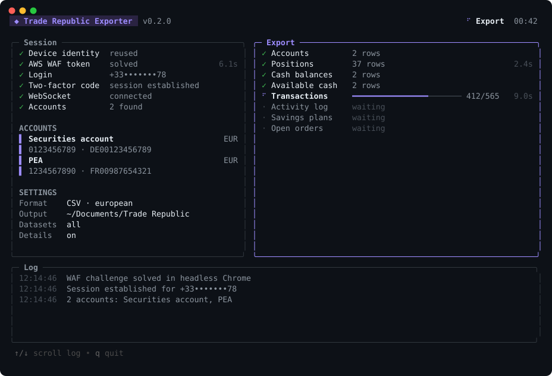
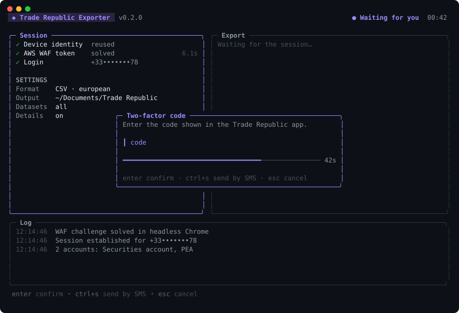
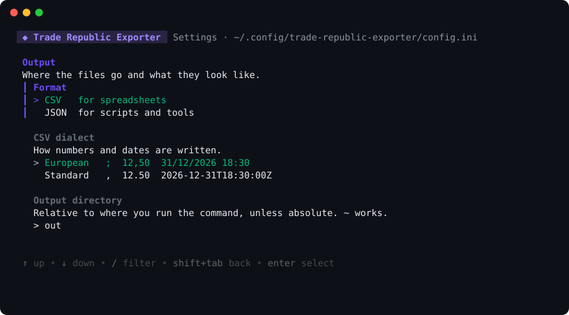

# trade-republic-exporter

[](https://github.com/souProjet/trade-republic-exporter/actions/workflows/ci.yml)
[](https://pkg.go.dev/github.com/souProjet/trade-republic-exporter)
[](https://goreportcard.com/report/github.com/souProjet/trade-republic-exporter)
[](https://github.com/souProjet/trade-republic-exporter/releases/latest)
[](LICENSE)

[English](README.md) | **Français**

Exportez vos données Trade Republic en CSV ou JSON depuis un tableau de bord
plein écran dans le terminal : tous vos comptes (compte-titres, PEA, et tout
autre type de produit que Trade Republic renvoie), les positions de chacun
crypto comprise, les soldes espèces, les transactions, le journal d'activité,
les plans d'investissement et les ordres en cours.



> [!WARNING]
> Outil non officiel. Il pilote l'API privée de l'application web Trade
> Republic, qui peut casser à tout moment et dont l'usage peut contrevenir aux
> conditions générales de Trade Republic. À utiliser sur votre propre compte, à
> vos risques.

## Installation

Téléchargez un binaire macOS, Linux ou Windows depuis la
[dernière release](https://github.com/souProjet/trade-republic-exporter/releases/latest),
ou installez avec Go 1.25 ou plus récent :

```bash
go install github.com/souProjet/trade-republic-exporter/cmd/tr-export@latest
```

Chrome ou Chromium doit être installé : la connexion passe par un challenge
AWS WAF que seul un vrai navigateur sait résoudre.

## Démarrage rapide

```bash
tr-export --demo   # aperçu de l'interface avec des données fictives, sans connexion
tr-export          # le premier lancement ouvre l'éditeur de réglages, puis exporte
```

Le premier lancement demande votre numéro et votre PIN. Le PIN va dans le
trousseau système (Trousseau macOS, Gestionnaire d'identifiants Windows,
Secret Service sous Linux), jamais dans un fichier. Les lancements suivants se
connectent, demandent le code 2FA et exportent :



## Commandes

| Commande | Effet |
|----------|-------|
| `tr-export` | Lance un export avec les réglages enregistrés |
| `tr-export config` | Ouvre l'écran des réglages |
| `tr-export config show` | Liste chaque réglage, sa valeur et sa provenance |
| `tr-export config get CLÉ` | Affiche un réglage, pour les scripts |
| `tr-export config set CLÉ VALEUR` | Modifie un réglage |
| `tr-export config set account.pin` | Enregistre le PIN dans le trousseau, saisi sans écho |
| `tr-export config unset CLÉ` | Revient à la valeur par défaut |
| `tr-export config edit` | Ouvre le fichier dans `$VISUAL` ou `$EDITOR` |
| `tr-export config path` | Affiche l'emplacement du fichier |
| `tr-export config reset` | Supprime les réglages et le PIN enregistré |
| `tr-export completion SHELL` | Complétion bash, zsh, fish ou PowerShell, clés et valeurs comprises |

L'écran des réglages présente tout sur une seule page, groupé en compte,
export, données et interface, avec la provenance de chaque valeur et une
explication du réglage sélectionné. `↑↓` pour naviguer, `←→` pour changer un
choix, `entrée` pour saisir un texte ou choisir les jeux de données, `ctrl+s`
pour enregistrer.

L'interface est en français ou en anglais : `tr-export config set
interface.language fr`, ou le réglage Langue de l'écran. Par défaut, elle suit
la langue du système.



### Options d'export

Les options remplacent les réglages enregistrés le temps d'un run.

| Option | Description |
|--------|-------------|
| `-f, --format csv\|json` | Format de sortie |
| `--dialect european\|standard` | Variante de CSV, voir plus bas |
| `-o, --out DOSSIER` | Dossier de sortie |
| `--datasets a,b,c` | Seulement ces jeux de données |
| `-d, --details` | Enrichit chaque transaction : frais, quantités, lieu d'exécution (plus lent) |
| `--plain` | Sortie ligne à ligne au lieu du tableau de bord |
| `-q, --quiet` | Seulement les avertissements et erreurs |
| `--demo` | Données fictives, sans connexion, rien n'est écrit |
| `--config FICHIER` | Utilise un autre fichier de réglages |

## Réglages

Les réglages vivent dans `~/.config/trade-republic-exporter/config.ini`
(`$XDG_CONFIG_HOME` est respecté ; `%AppData%` sous Windows), écrit en lecture
seule pour son propriétaire. `tr-export config show` indique d'où vient chaque
valeur : environnement, fichier, trousseau ou défaut.

| Clé | Défaut | Description |
|-----|--------|-------------|
| `account.phone_number` | | Format international, par exemple `+33612345678` |
| `account.pin` | | Dans le trousseau système, jamais dans le fichier |
| `account.device_info` | généré | Identité d'appareil, enregistrée après la première connexion |
| `export.format` | `csv` | `csv` ou `json` |
| `export.csv_dialect` | `european` | `european` ou `standard` |
| `export.output_dir` | `out` | Relatif au dossier courant sauf chemin absolu ; `~` fonctionne |
| `export.datasets` | `all` | Liste séparée par des virgules, voir plus bas |
| `export.details` | `false` | Récupère la vue détaillée de chaque transaction |
| `interface.mode` | `auto` | `auto`, `fullscreen` ou `plain` |
| `interface.language` | `auto` | `auto`, `en` ou `fr` ; `auto` suit la langue du système |

Les variables d'environnement l'emportent sur le fichier et le trousseau, pour
les tâches planifiées ou la CI : `TR_PHONE_NUMBER`, `TR_PIN`,
`TR_DEVICE_INFO`, et `TR_WAF_TOKEN` pour réutiliser un token WAF sans lancer
Chrome.

## Ce qui est exporté

| Jeu de données | Contenu | Souscription |
|----------------|---------|--------------|
| `accounts` | Une ligne par couple de comptes, avec son type de produit et ses numéros de compte-titres et d'espèces | `accountPairs` |
| `positions` | Positions de chaque compte-titres, une ligne par position, taguée avec le compte propriétaire. Le crypto est l'une des catégories | `compactPortfolioByType` |
| `cash` | Solde espèces de chaque compte | `cash` |
| `available_cash` | Liquidités disponibles pour investir, hors fonds réservés par les ordres en cours | `availableCash` |
| `transactions` | Historique complet des transactions, paginé jusqu'au bout | `timelineTransactions` |
| `activity_log` | Connexions, documents, modifications du compte | `timelineActivityLog` |
| `savings_plans` | Plans d'investissement programmé | `savingsPlans` |
| `orders` | Ordres en cours | `orders` |

Avec les détails activés, chaque transaction reçoit des colonnes
`detail.<section>.<champ>` issues de sa vue détaillée.

Une souscription refusée par l'API apparaît comme jeu de données en échec et le
run continue avec les autres, avec un code de sortie non nul à la fin. Une
erreur n'est jamais écrite comme un fichier vide : un portefeuille refusé ne
peut pas être confondu avec un portefeuille vide.

### Dialectes CSV

| Dialecte | Séparateur | Décimale | Horodatage | BOM | Pour |
|----------|------------|----------|------------|-----|------|
| `european` | `;` | `12,50` | `31/12/2026 18:30` heure locale | oui | Excel, Numbers, LibreOffice en locale européenne |
| `standard` | `,` | `12.50` | `2026-12-31T18:30:00+01:00` | non | Locales anglaises, pandas, bases de données |

Les objets imbriqués deviennent des colonnes pointées comme `amount.value`, les
listes restent en JSON compact dans une cellule. Préférez JSON pour un
traitement sans perte.

## Interface

Dans un terminal, l'export tourne dans un tableau de bord plein écran : étapes
de connexion et comptes à gauche, jeux de données avec progression en direct à
droite, journal défilant en bas. Il s'adapte aux terminaux clairs ou sombres et
aux fenêtres étroites.

| Touche | Action |
|--------|--------|
| `entrée` | Valide le code 2FA |
| `ctrl+s` | Reçoit le code par SMS à la place |
| `échap` | Annule la saisie et le run |
| `↑` `↓` | Fait défiler le journal |
| `o` | Ouvre le dossier de sortie une fois terminé |
| `q` | Quitte, en annulant un run en cours |

À la fermeture du tableau de bord, la liste des fichiers écrits reste à
l'écran. Une sortie redirigée, `--plain` ou `interface.mode = plain` passent en
sortie ligne à ligne, adaptée aux logs et aux tâches cron ; `NO_COLOR` est
respecté.

## Fonctionnement

1. Chrome headless charge l'application web et obtient un `aws-waf-token`, sans
   lequel l'API répond 403.
2. `POST /api/v1/auth/web/login` avec le numéro et le PIN démarre une
   connexion ; le code 2FA la termine et renvoie un cookie de session.
3. Une connexion WebSocket vers `api.traderepublic.com` transporte les données :
   chaque requête est une trame `sub` à laquelle répond une trame `A`, ou une
   trame `E` en cas de refus.
4. Les comptes sont découverts d'abord, puis chaque jeu de données par compte
   est récupéré pour chacun d'eux.

Les identifiants ne vont qu'à Trade Republic : pas de serveur, pas de
télémétrie, pas de tiers. Voir [SECURITY.md](SECURITY.md).

## Mise à jour depuis la 0.1

Le premier lancement importe un `config.ini` trouvé dans le dossier courant vers
le nouvel emplacement et déplace le PIN dans le trousseau. L'ancien fichier est
laissé en place : supprimez-le, il contient toujours le PIN en clair.

## Développement

```bash
make test     # go test ./...
make race     # avec le détecteur de concurrence
make demo     # tableau de bord avec des données fictives
make help     # toutes les cibles
```

| Package | Responsabilité |
|---------|----------------|
| `internal/cli` | Commandes et options (Cobra, mis en forme par Fang) |
| `internal/tui` | Tableau de bord plein écran et éditeur de réglages (Bubble Tea, Huh) |
| `internal/ui` | Sortie ligne à ligne pour les pipes et les logs |
| `internal/report` | Contrat entre le pipeline et les deux interfaces |
| `internal/app` | Pipeline : connexion, découverte des comptes, export |
| `internal/config` | Fichier de réglages, trousseau, environnement |
| `internal/trws` | Protocole WebSocket et souscriptions |
| `internal/auth` | Connexion web et 2FA |
| `internal/waf` | Challenge AWS WAF dans Chrome headless |
| `internal/export` | Catalogue des jeux de données, écriture CSV et JSON |

Le protocole n'est pas documenté par Trade Republic. Il a été reconstitué à
partir des clients open source crédités plus bas, et les payloads sont parsés
avec tolérance pour qu'un champ renommé dégrade au lieu de tout casser. Les
contributions sont bienvenues : voir [CONTRIBUTING.md](CONTRIBUTING.md) et le
[changelog](CHANGELOG.md).

## Crédits

- [BenjaminOddou/trade_republic_scraper](https://github.com/BenjaminOddou/trade_republic_scraper),
  l'outil Python dont celui-ci est parti comme réécriture
- [pytr-org/pytr](https://github.com/pytr-org/pytr), la cartographie la plus
  complète des types de souscription Trade Republic
- [we-promise/sure#3986](https://github.com/we-promise/sure/pull/3986), qui
  documente la découverte multi-comptes via `accountPairs`
- [Charm](https://charm.land) pour Bubble Tea, Lip Gloss, Huh et Fang

## Licence

MIT, voir [LICENSE](LICENSE).
